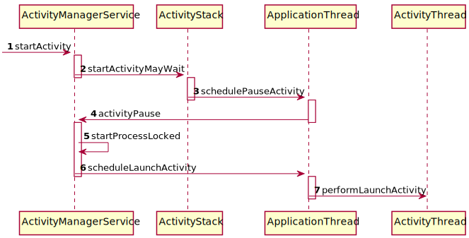
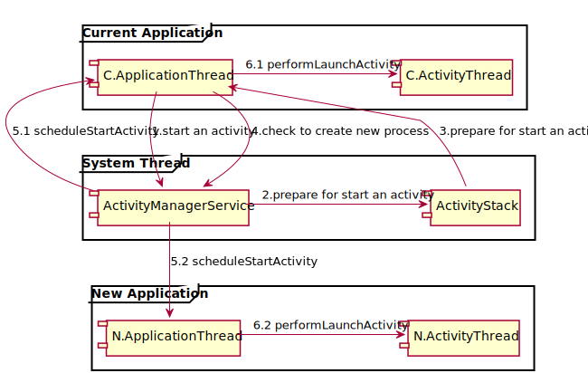

> 关于Android Actviity启动过程的学习，学习资料来自于老罗的相关系列博客 [《简要介绍和学习计划》](http://blog.csdn.net/cuikai314/article/details/6704089)、[《应用程序启动过程》](http://blog.csdn.net/luoshengyang/article/details/6689748)、[《内部启动流程》](http://blog.csdn.net/luoshengyang/article/details/6703247)

# Activity启动流程简要介绍和学习计划

上面是一张`Activity`简要启动流程图。在这张图中主要涉及到四个关键类`ActivityManagerService/ActivityStack/ApplicationThread/ActivityThread`；其中，`ActivityManagerService`和`ActivityStack`位于同一个进程中，用于管理系统的所有`Actviity`的启动等相关行为；`ActivityThread`和`ApplicationThread`位于同一个应用程序中，`ActivityThread`是该应用程序的主线程也就是我们常说到的`UI线程`，而`ApplicationThread`是`ActivityThread`中的一个`Bindle`实例用来实现和`AMS/AS`的进程间通讯。

整个启动流程从调用`AMS.startActivity`开始，调用的发起是当前的应用程序通过其`ApplicationThread`对象完成的，而如果当前处于手机的主屏幕界面，则这个调用程序就是当前系统的`Launcher`；在`AMS`收到启动界面的调用之后，会让同一个线程中的`AS`进行启动一个新`Activity`的相关准备；在`AMS/AS`都完成的启动`Activity`的相关准备之后执行流程会回到发起启动`Activity`请求的应用程序，并由该程序的`ApplicationThread`来完成当前应用程序`Activity`的`Pause`操作；在上面的所有准备工作已经完成之后，交由`AMS`来判断启动的新`Activity`时候在原有的应用程序中；如果在原有的应用程序中，则直接调用该应用程序的`ApplicationThread`和`ActivityThread`来进行启动界面的相关操作；如果启动的`Activity`在新的应用程序中，则会在创建该应用程序对应的线程之后再去执行启动的界面的操作。

上面的组件图是从启动的流程图中总结出来的。通过这个组件图我们可以对整个启动的流程做出一个比较简洁的步骤归纳:

1. 准备。在启动新的`Activity`之前需要在`AS`中进行一些准备操作，同时当前的应用程序也需要暂停当前的界面

2. 新进程。启动界面之前需要判断该界面是否属于发起启动请求的应用程序，由此来决定是否需要为之创建一个新的进程

3. 启动。最后的启动操作会集中在对应`ActivityThread`中来完成。

## 小结

上面的这些内容只是对`Activity`启动流程一个简要的归纳，在了解了相关类和步骤之后可以更好的登堂入室，详细深入的学习。
