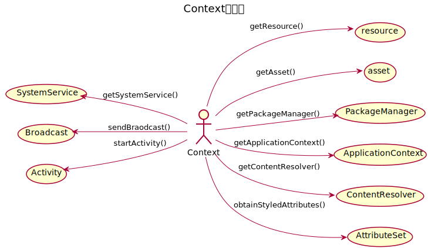
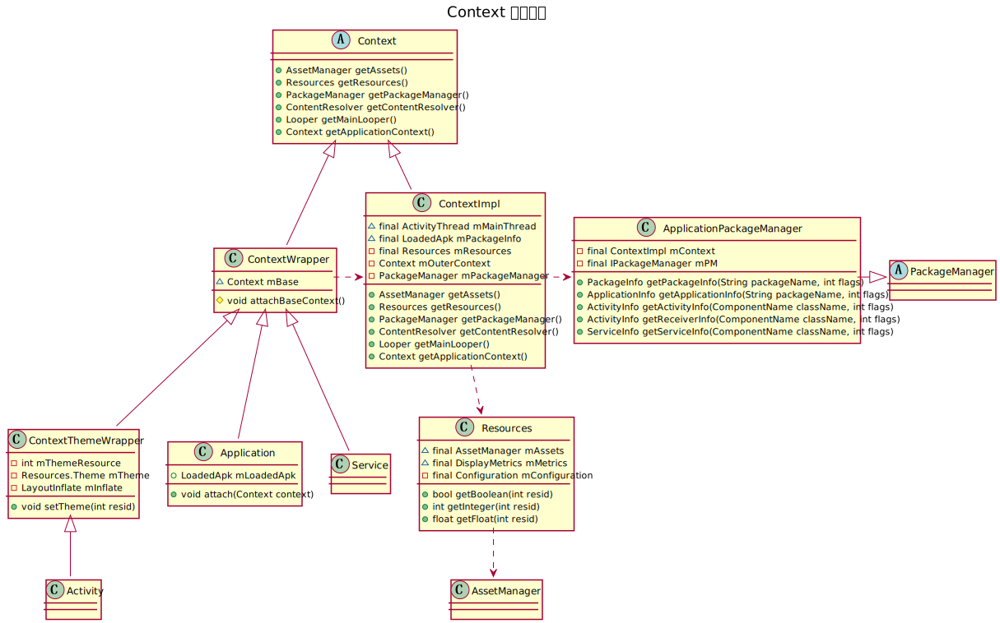
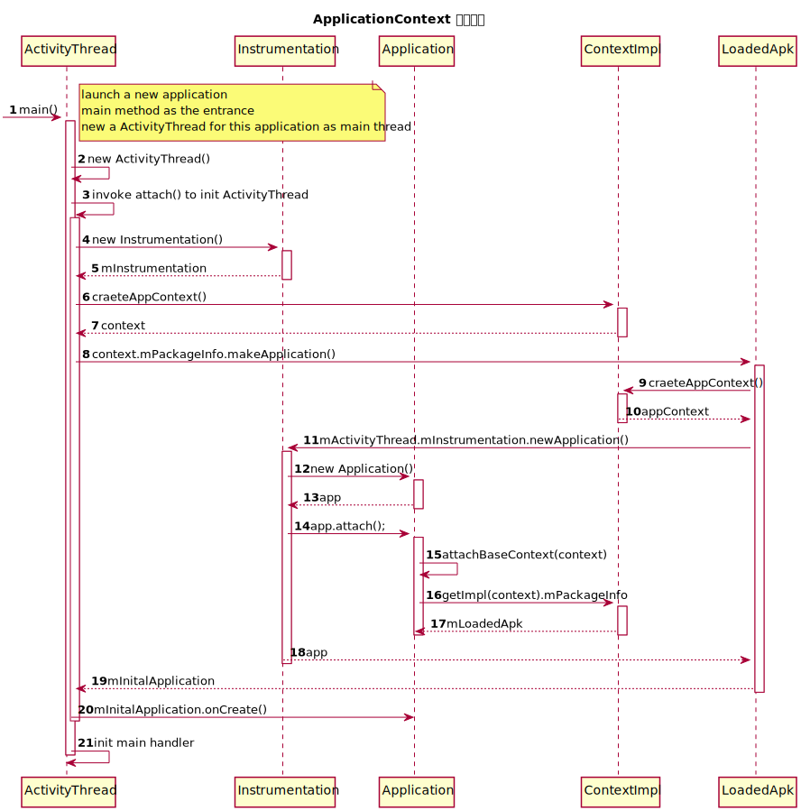
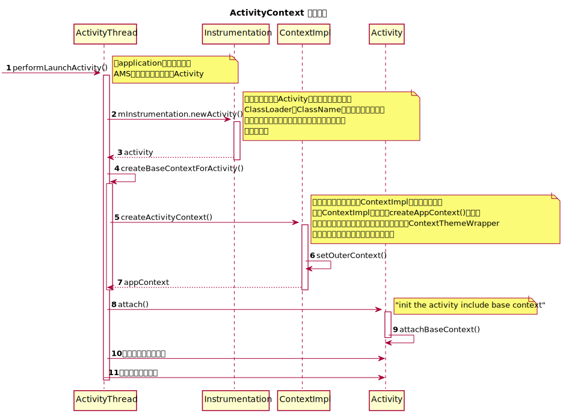

> 对于前段时间关于Context学习的汇总，同时也是分享内容的总体大纲

# Context

怎样去定义Context的位置？

贯穿于整个应用的上下文？

或者是提供应用运行时需要的资源，信息等的运行时环境？

又或者是负责启动Activity,Service的场景切换？

对于这些问题的回答和探索只能够通过阅读和理解Context的源代码进行探究和回答。所以，Read The Fucking Source Code!!!

# Context 干些什么

时间和能力上的限制决定了不可能完全的将Context的源代码阅读一遍，只能够通过将其开放出来的接口归纳成为用例图，有目的地去阅读某一部分的代码。



上面的用例图中归纳了Context的常用方式，这种归纳不能做到完备只能说将常见使用枚举出来然后去探究平时在使用这些接口的时候我们本质到上做了什么事情

# Context 组成结构



我们一直讨论的Context实际上是一个抽象类，只是负责定义Context需要提供的接口而不会做具体的实现；这些具体的实现都交由`ContextImpl`子类来完成，而我们常常接触到的`Activity/Application`等实际上都是直接或间接继承自`ContextWrapper`，其中`Activity`因为涉及到界面主题之类的内容而直接继承自`ContextWrapper`的子类`ContextThemeWrapper`；从类图上可以看到`ContextWrapper`对`ContextImpl`有一个依赖，这是因为`ContextWrapper`实际上也没有自己去实现`Context`所定义的那些接口而是桥接到一个`ContextImpl`内部变量来完成这些功能。所以为了弄清楚上面用例图中提及到的接口，我们只需要将重点放在`ContextImpl`的源代码研究即可。

## getResources

```java
public Resources getResources() {
    return mResources;
}
```

从代码中可以看到我们使用`Context`来获取资源的时候只是简单的将其内容`Resources`实例变量返回出来，至于这个实例变量的来源是在哪里，我们在讨论`Context`创建过程的时候再详细学习。

关于`Resources`从上面的类图中可以大致的看出，这个类抽象了应用程序资源访问的接口从而实现资源的统一管理，虽然在其内部将实际的资源访问操作交给了`AssetManager`来完成；同时对应应用程序来说，`Resources`是一个单例的结构。

## getAssets

```java
public AssetManager getAssets() {
    return getResources().getAssets();
}
```

`getAssets()`函数通过`mResources`对象获取到`AssetManager`对象并返回出来。在介绍`Resources`的时候将其归结为资源访问的抽象用于提供资源访问的接口，那么`AssetManager`则是真正的资源管理者，即便是`Resources`的资源操作接口内部实质也是通过`AssetManager`实现的。

## getPackageManager

```java
public PackageManager getPackageManager() {
    if (mPackageManager != null) {
        return mPackageManager;
    }

    IPackageManager pm = ActivityThread.getPackageManager();
    if (pm != null) {
        // Doesn't matter if we make more than one instance.
        return (mPackageManager = new ApplicationPackageManager(this, pm));
    }

    return null;
}
```

`PackageManager`本身是一个抽象类，在代码中直接创建的是它的一个子类`ApplicationPackageManager`。从上面的类图里面可以看到，这个子类提供了获取应用程序各种相关信息的接口，比如四大组件又或者是安装包的信息之类的。所以`ContextImpl`也可以间接的通过这个成员变量开放出应用程序信息查询的接口。

### getApplicationContext

```java
public Context getApplicationContext() {
  return (mPackageInfo != null) ?
          mPackageInfo.getApplication() : mMainThread.getApplication();
}
```

`getApplicationContext`基于两个内部变量进行获取，因为`ActivityThread`是启动一个应用程序时最先初始化的对象，所以即使`mPackageInfo`为空的情况下依然可以依赖这个对象去获取`ApplicationContext`

### 小结

到此为止，关于`Context`相关的类结构和常用接口源代码分析可以告一段落了，剩下一些在用例图中提及到但是没有进行分析的接口主要是那边的应用场景暂时还没有很深的接触或者是需要其他一些比较重的支持储备，所以只能够暂时搁置，以后再补全吧。

# Context 创建流程

前面的内容介绍了`Context`的相关类结构以及部分常用源代码的分析，但是关于`Context`是怎么样创建的并没有提及到，对于里面的一些关键变量的来源和赋值也没有涉及到。所以，接下的部分会详细的研究`Context`的创建流程，主要的研究对象是`Activity/Application`

## ApplicationContext 创建过程



上面展示的是`ApplicationContext`创建过程的代码执行流程图，下面会跟着这个流程图对其中的一些关键部分进行详细的了解

### Step1:ActivityThread.main()

每当启动一个新的应用程序的时候都会去创建该程序对应的一个全局`Application`实例，而这个实例就是我们在这里一直讨论的`ApplicationContext`。和我们熟悉的`Java`应用程序一样，`Android`应用程序同样也有它自己的`main函数`作为程序的入口，这个`main函数`位于`ActivityThread`类中。下面是该函数中的一些关键代码：

```Java
public static void main(String[] args) {
  ...

  Looper.prepareMainLooper();

  ActivityThread thread = new ActivityThread();
  thread.attach(false);

  if (sMainThreadHandler == null) {
      sMainThreadHandler = thread.getHandler();
  }

  ...

  Looper.loop();

  throw new RuntimeException("Main thread loop unexpectedly exited");
}
```

在上面的代码中主要做了两件事情，一个是启动主线程的消息循环；另一个则是创建并初始化应用程序的主线程`ActivityThread`，而我们所关心的`ApplicationContext`就是在这里面发生的。

### Setp3:ActivityThread.attach()

因为在`ActivityThread`构造函数中并没有去做什么和`Context`相关的内容，所以我们在这里就直接跳到step3

```Java
...
Instrumentation mInstrumentation;
Application mInitialApplication;
...
private void attach(boolean system){
  ...
  try {
      mInstrumentation = new Instrumentation();
      ContextImpl context = ContextImpl.createAppContext(
              this, getSystemContext().mPackageInfo);
      mInitialApplication = context.mPackageInfo.makeApplication(true, null);
      mInitialApplication.onCreate();
  } catch (Exception e) {
      throw new RuntimeException(
              "Unable to instantiate Application():" + e.toString(), e);
  }
  ...
}
```
`attach()`的作用主要是用来初始化`ActivityThread`对象实例，在这个初始化的过程中创建了两个实例变量分别是`mInstrumentation`和`mInitialApplication`，`mInstrumentation`主要用来监听系统和应用程序之间的交互而`mInitialApplication`则就是我们所等待的`ApplicationContext`。在此之前我们提及过`ApplicationContext`继承自`ContextWrapper`，所以在其内部会有一个`ContextImpl`对象用来完成`Context`需要完成的内容。从这段代码中我们也理所当然的看到了`ContextImpl`的创建。

### Step6:ContextImpl.createAppContext()

```Java
static ContextImpl createAppContext(ActivityThread mainThread, LoadedApk packageInfo) {
   if (packageInfo == null) throw new IllegalArgumentException("packageInfo");
   return new ContextImpl(null, mainThread,
           packageInfo, null, null, false, null, null, Display.INVALID_DISPLAY);
}
```

这个函数中简单的调用了构建函数来创建一个`ContextImpl`实例，具体的实现过程和传入的参数内容在这里先不做深入的研究。

### Step8:LoadedApk.makeApplication()

```Java
public Application makeApplication(boolean forceDefaultAppClass,
            Instrumentation instrumentation) {
    if (mApplication != null) {
        return mApplication;
    }

    Application app = null;

    String appClass = mApplicationInfo.className;
    if (forceDefaultAppClass || (appClass == null)) {
        appClass = "android.app.Application";
    }

    try {
        java.lang.ClassLoader cl = getClassLoader();
        if (!mPackageName.equals("android")) {
            initializeJavaContextClassLoader();
        }
        ContextImpl appContext = ContextImpl.createAppContext(mActivityThread, this);
        app = mActivityThread.mInstrumentation.newApplication(
                cl, appClass, appContext);
        appContext.setOuterContext(app);
    } catch (Exception e) {
        if (!mActivityThread.mInstrumentation.onException(app, e)) {
            throw new RuntimeException(
                "Unable to instantiate application " + appClass
                + ": " + e.toString(), e);
        }
    }
    mActivityThread.mAllApplications.add(app);
    mApplication = app;
    ...

    return app;
}
```

在调用`LoadedApk.makeApplication()`创建`Application`的时候首先回去检查`mApplication`这个本地变量是否存在，如果这个变量已经存在就会直接返回，否在在通过调用`Instrumentation.newApplication()`函数进行创建。在创建的过程中，对先去调用`ContextImpl.createAppContext()`为这个`Application`生成实现其功能的`ContextImpl`；这个函数的执行流程在上面已经具体的了解过，在其内部会调用`ContextImpl`的构造函数进行实例的创建。

### Step11:Instrumentation.newApplication()

```Java
static public Application newApplication(Class<?> clazz, Context context)
        throws InstantiationException, IllegalAccessException,
        ClassNotFoundException {
    Application app = (Application)clazz.newInstance();
    app.attach(context);
    return app;
}
```

`Instrumentation.newApplication()`会调用`Application`的无参构造函数创建一个实例，随后在去调用`Application.attach()`方法对实例进行初始化操作。

### Step14:Application.attach()

```Java
final void attach(Context context) {
    attachBaseContext(context);
    mLoadedApk = ContextImpl.getImpl(context).mPackageInfo;
}
```

`Application.attach()`调用`Application.attachBaseContext()`将当前传入的`ContextImpl`实例赋值给`mBase`实例变量，至此，用于实现`Context`功能的实例变量已经有了；之后还会对`mLoadedApk`变量进行复制，然后整个`Application`的创建过程就算是完成了。


## ActivityContext 创建过程



### Step1: ActivityThread.performLaunchActivity()

```java
private Activity performLaunchActivity(ActivityClientRecord r, Intent customIntent) {
	...
	Activity activity = null;
	try {
		java.lang.ClassLoader cl = r.packageInfo.getClassLoader();
		activity = mInstrumentation.newActivity(
				cl, component.getClassName(), r.intent);
		...
	} catch (Exception e) {
		if (!mInstrumentation.onException(activity, e)) {
			throw new RuntimeException(
				"Unable to instantiate activity " + component
				+ ": " + e.toString(), e);
		}
	}

	try {
		Application app = r.packageInfo.makeApplication(false, mInstrumentation);
		if (activity != null) {
			Context appContext = createBaseContextForActivity(r, activity);
			CharSequence title = r.activityInfo.loadLabel(appContext.getPackageManager());
			Configuration config = new Configuration(mCompatConfiguration);

			activity.attach(appContext, this, getInstrumentation(), r.token,
					r.ident, app, r.intent, r.activityInfo, title, r.parent,
					r.embeddedID, r.lastNonConfigurationInstances, config,
					r.referrer, r.voiceInteractor);

			...
			int theme = r.activityInfo.getThemeResource();
			if (theme != 0) {
				activity.setTheme(theme);
			}

			//调用Activity生命周期函数
		}
		r.paused = true;

		mActivities.put(r.token, r);

	} catch (SuperNotCalledException e) {
		throw e;

	} catch (Exception e) {
		if (!mInstrumentation.onException(activity, e)) {
			throw new RuntimeException(
				"Unable to start activity " + component
				+ ": " + e.toString(), e);
		}
	}

	return activity;
}

```

在`Application`创建完成之后，`AMS`会通过`Binder`机制通知`ActivityThread`去创建`Activity`，而这个创建的过程最终辗转到了`performLaunchActivity`。上面的代码是该函数精简后的关键代码，省略了一些和`Context`无关的内容。在这个函数中，完成了`Activity`的创建、属性初始化和生命周期调用。下面会逐步分析整个创建的过程。

### Instrumentation.newActivity

```java
public Activity newActivity(ClassLoader cl, String className,Intent intent)
throws InstantiationException, IllegalAccessException,ClassNotFoundException {
    return (Activity)cl.loadClass(className).newInstance();
}
```

`ActivityThread`首先会调用`Instrumentation.newActivity()`来创建一个`Activity`实例。从上面的代码中可以知道，这个函数会通过出入的`ClassLoader`加载`Activity`并调用其无参构造函数创建实例。

### LoadedApk.makeApplication

```java
  // 略，参上
```

在`Activity`实例创建完成之后会继续为该实例对象准备其初始化需要的数据，首先就是调用`LoadedApk.makeApplication()`为其获取当前应用程序的`Application`对象。其实这个函数在之前我们学习`ApplicationContext`创建过程的时候已经了解过其中的运行的源代码，所以这里就不会再深入的进行探讨，只需知道这个函数会返回一个单例`Application`对象即可。

### ActivityThread.createBaseContextForActivity & ContextImpl.createActivityContext

```java
private Context createBaseContextForActivity(ActivityClientRecord r, final Activity activity) {
	int displayId = Display.DEFAULT_DISPLAY;
	try {
		displayId = ActivityManagerNative.getDefault().getActivityDisplayId(r.token);
	} catch (RemoteException e) {
	}

	ContextImpl appContext = ContextImpl.createActivityContext(
			this, r.packageInfo, displayId, r.overrideConfig);
	appContext.setOuterContext(activity);
	Context baseContext = appContext;
  ...
	return baseContext;
}
```

```java
static ContextImpl createActivityContext(ActivityThread mainThread,
		LoadedApk packageInfo, int displayId, Configuration overrideConfiguration) {
	if (packageInfo == null) throw new IllegalArgumentException("packageInfo");
	return new ContextImpl(null, mainThread, packageInfo, null, null, false,
			null, overrideConfiguration, displayId);
}
```

在获取到该应用的`Application`实例对象之后，仍然会继续创建其他用于初始化该`Activity`对象的参数，其中就包括其自身的`ContextImpl`。在为`Activity`实例创建过`ContextImpl`时候，首先会去调用`ActivityThread.createBaseContextForActivity`和`ContextImpl.createActivityContext`根据传入的参数为该对象创建`ContextImpl`

### Activity.attach

```java
final void attach(Context context, ActivityThread aThread,
            Instrumentation instr, IBinder token, int ident,
            Application application, Intent intent, ActivityInfo info,
            CharSequence title, Activity parent, String id,
            NonConfigurationInstances lastNonConfigurationInstances,
            Configuration config, String referrer, IVoiceInteractor voiceInteractor) {
    attachBaseContext(context);

    mFragments.attachHost(null /*parent*/);

    mWindow = new PhoneWindow(this);
    mWindow.setCallback(this);
    mWindow.setOnWindowDismissedCallback(this);
    mWindow.getLayoutInflater().setPrivateFactory(this);
    if (info.softInputMode != WindowManager.LayoutParams.SOFT_INPUT_STATE_UNSPECIFIED) {
        mWindow.setSoftInputMode(info.softInputMode);
    }
    if (info.uiOptions != 0) {
        mWindow.setUiOptions(info.uiOptions);
    }
    mUiThread = Thread.currentThread();

    mMainThread = aThread;
    mInstrumentation = instr;
    mToken = token;
    mIdent = ident;
    mApplication = application;
    mIntent = intent;
    mReferrer = referrer;
    mComponent = intent.getComponent();
    mActivityInfo = info;
    mTitle = title;
    mParent = parent;
    mEmbeddedID = id;
    mLastNonConfigurationInstances = lastNonConfigurationInstances;
    if (voiceInteractor != null) {
        if (lastNonConfigurationInstances != null) {
            mVoiceInteractor = lastNonConfigurationInstances.voiceInteractor;
        } else {
            mVoiceInteractor = new VoiceInteractor(voiceInteractor, this, this,
                    Looper.myLooper());
        }
    }

    mWindow.setWindowManager(
            (WindowManager)context.getSystemService(Context.WINDOW_SERVICE),
            mToken, mComponent.flattenToString(),
            (info.flags & ActivityInfo.FLAG_HARDWARE_ACCELERATED) != 0);
    if (mParent != null) {
        mWindow.setContainer(mParent.getWindow());
    }
    mWindowManager = mWindow.getWindowManager();
    mCurrentConfig = config;
}
```

最后，在所有的参数都创建完毕之后，直接调用`Activity.attach()`函数进行初始化操作。而在这个函数里面，我们关心的只有调用了`attachBaseContext`将传入的之前为其创建的`ContextImpl`实例用于完成`Context`的职责。至此，`Activity`创建流程中关于`Context`的内容就已经分析完了。

### 小结

整个`ActivityContext`创建流程分析下来，其实基本上就是可以归结成这样一个步骤

"创建Activity实例" --> "构建Activity初始化参数，主要是ContextImpl" --> "进行初始化操作"

在这个流程中`Instrumentation/ContextImpl`两个类都起到了很大的作用，一个是创建了`Activity`实例对象，另一个为该对象生成对应的`ContextImpl`变量。

# Context 是什么

没错，虽然洋洋洒洒写了这么多东西，但是我还是没有办法很明确的说`Context`到底是一个什么东西。只能从涉及到的代码给它下这样子的一个定义，抽象应用程序逻辑之外的资源或信息相关的接口
