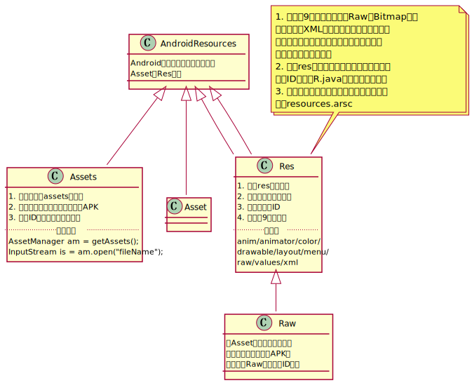

> 资源框架学习笔记，记录学习过程中的一些想法和感悟，学习完之后再进行系统的梳理

# Android 资源管理框架

> 来源于老罗的博客[《Android 资源管理框架简要介绍和学习计划》](http://blog.csdn.net/luoshengyang/article/details/8738877)

## Android 资源组成结构



Android应用程序的资源大体上可以分成上图展示的两种类型`Asset/Res`，两种不同的类型在保存内容和访问处理方式上都有各自的特点。

### Asset

Asset类型的资源保存的都是一些原始文件，这些原始文件在资源编译打包的时候不会做任何的处理而是直接这样打包到APK当中。这些资源都放置在项目的asset目录下，因为这些原始文件在资源编译的时候不会被分配资源ID，所以需要访问的时候只能够通过文件名定位并且使用`AssetManager`提供的对应接口

```java
AssetManager am = getAssets();
InputStream is = am.open("fileName");
```

### Res

Res涵盖了Android应用程序涉及到的绝大部分资源类别。概括起来会有下面的这些特点

1. Res中的所有资源在应用程序资源编译打包的时候都会分配一个用于访问的常量资源ID保存在R.java中
2. Res中资源大体可以细分成下面的九种类型`anim/animator/color/drawable/layout/menu/raw/values/xml`；其中，raw类型资源其实和asset一样也是保存一些原始文件并且会直接打包到APK中不进行任何的处理，它们之间最大的区别就是第一点描述的raw可以通过ID访问而asset不行。
3. Res中所有的xml文件在资源编译打包之后都会拥有一个字符串资源池用于优化文件的体积和解析速度，同时这些xml文件也会编译成二进制文件保存到APK中

# Android 应用程序资源管理器创建过程分析

> 来源于老罗的博客[《Android应用程序资源管理器（Asset Manager）的创建过程分析》](http://blog.csdn.net/luoshengyang/article/details/8791064)

就像老罗在学习计划中介绍的那样，可以将Android的资源体系分成Resource/Asset两种类型，而实际上就算是Resource访问资源的操作也是通过桥接到AssetManager上实现的大体结构如[资源类结构](/ResourcesClassDiagram.pu)

在资源管理结构中比较重要的几个类的关系图如[AssetManager Structure Class Diagram](/AssetManagerStructure.pu)
