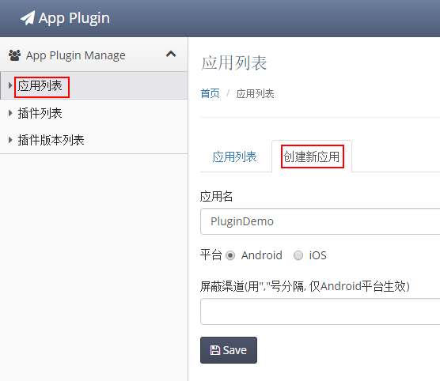
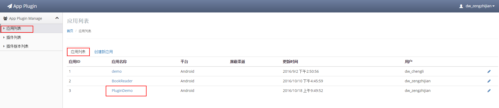
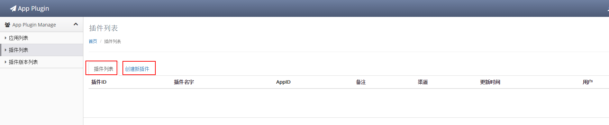
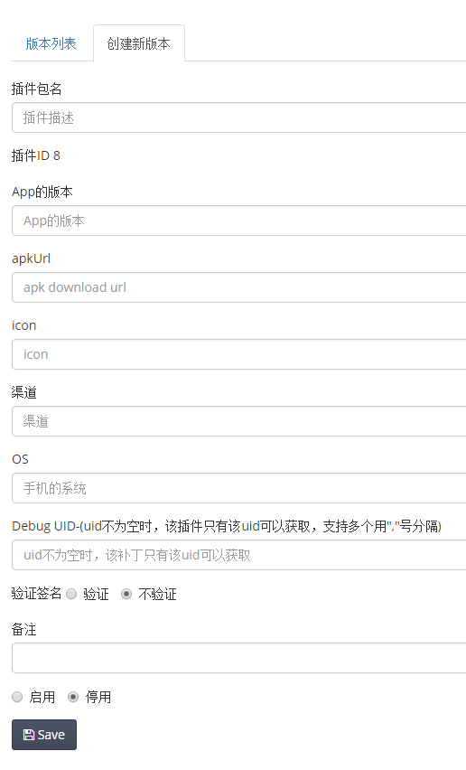

<!-- toc orderedList:0 -->

- [Usage](#usage)
	- [Quick Start](#quick-start)
		- [添加依赖](#添加依赖)
		- [初始化插件管理系统](#初始化插件管理系统)
		- [安装插件](#安装插件)
		- [运行插件](#运行插件)
	- [Abstract](#abstract)
		- [SDK集成](#sdk集成)
		- [功能支持](#功能支持)
	- [添加依赖](#添加依赖-1)
	- [插件系统初始化操作](#插件系统初始化操作)
	- [插件源](#插件源)
	- [预装载插件](#预装载插件)
	- [插件安装](#插件安装)
	- [运行插件](#运行插件-1)
	- [插件的运行状态](#插件的运行状态)
	- [卸载与删除插件](#卸载与删除插件)
	- [附录1：插件服务器配置](#附录1插件服务器配置)

<!-- tocstop -->

# Usage

- Quick Start
- Abstract
- 添加依赖
- 插件系统初始化操作
- 插件服务器配置
- 本地插件
- 预装载插件
- 安装插件
- 运行插件
- 插件运行的状态
- 卸载与删除插件

## Quick Start

### 添加依赖

mavne依赖
```xml
<dependency>
  <groupId>com.yy.pluginmgr</groupId>
  <artifactId>pluginmgr-aar</artifactId>
  <version>1.0.6-SNAPSHOT</version>
  <type>aar</type>
</dependency>
```
添加`mergeManifests`的设置
```xml
<build>
  <pluginManager>
    <plugins>
      <plugin>
        <groupId>com.jayway.maven.plugins.android.generation2</groupId>
        <artifactId>android-maven-plugin</artifactId>
        <configuration>
          <!-- add the following mergeManifests option -->
          <mergeManifests>true</mergeManifests>
        </configuration>
      </plugin>
    </plugins>
  <PluginManager>
</build>
```
`Gradle`项目直接下载aar进行本地依赖，[下载地址](http://repo.yypm.com:8181/nexus/index.html#nexus-search;quick~pluginmgr)

### 初始化插件管理系统

首先，直接使用`PluginApplication`或者在自定义application中进行如下调用

```java
public class CustomApplication extends Application{
  @override
  public void onCreate(){
    super.onCreate();
    PluginHelper.getInstance().applicationOnCreate(this);
  }

  @Override
  protected void attachBaseContext(Context base) {
      PluginHelper.getInstance().applicationAttachBaseContext(base);
      super.attachBaseContext(base);
  }
}
```

然后调用下面接口开启插件管理系统

```java
/**
 * @param appId 宿主程序ID，参见附录1：插件服务器配置
 * @param appVer 宿主程序版本，同上
 * @param market 宿主程序对应的下载市场
 * @param uid 当前用户uid
 */
DroidPluginManager.init(Context context, int appId, String appVer, String market, String uid);
```

### 安装插件

```java
// 1.安装已经在系统中的插件
Plugin plugin = PluginConfigManager.getPlugin(pluginID);
DroidPluginManager.instance().installPlugin(plugin.packageName);

// 2.安装本地插件
DroidPluginManager.instance().installPluginFromPath(apkFilePath);
```

### 运行插件

```java
DroidPluginManager.instance().startPlugin(packageName);
```

## Abstract

```{viz}
digraph overview {
  // 定义节点
  edge[style = dashed, penwith = .7, color = purple];
  node[shape = box, color = blue];
  project[label = Usage];
  node[color = green]
  assemble[label = SDK集成];
  functionality[label = 功能支持];
  node[shape = underline, color = transparent, style = dashed, height = .0];
  dependency[label = 添加依赖];
  init[label = 插件系统初始化操作];
  plugin[label = 插件源];
  status[label = 插件运行状态];
  preload[label = 预装载插件];
  install[label = 安装插件];
  run[label = 运行插件];
  delete[label = 卸载与删除插件];


  // 定义关系
  rankdir = LR;
  project -> {assemble functionality};

  edge[color = slategrey]
  assemble -> {dependency init};
  functionality -> { plugin status preload install run delete};
}
```

上图是整篇内容的一个概览，主要划分成了系统使用前的SDK集成和使用时的功能支持。

### SDK集成

部分主要时为了介绍怎么样去将SDK集成到你当前正在开发的系统中。在按照这部分内容完成所有的步骤之后就可以在当前开发的应用在使用插件管理系统提供的功能支持

### 功能支持

枚举了插件管理系统提供的关键功能，这些功能在下面都会有进一步的详细介绍在这里只是先说明每个功能实现的需求

  - `插件源` 关于插件系统中运行的插件来源和配置操作流程
  - `插件运行状态` 介绍插件在使用周期中的不同状态
  - `预装载插件` 获取插件中用于展示的信息
  - `安装插件` 将插件安装到插件运行环境中，为插件运行做准备
  - `运行插件` 运行指定已安装插件
  - `卸载与删除插件` 对已经弃用的插件进行对应的操作

## 添加依赖

[项目在公司仓库的地址](http://repo.yypm.com:8181/nexus/index.html#nexus-search;quick~pluginmgr)

添加管理系统的依赖，`Maven`构建的项目可以直接使用公司仓库中提供的`Maven`依赖配置对构建出来的`aar`进行依赖。但是因为在管理系统中预先注册了用于插件运行使用的各种组件信息和权限，所以需要在主模块的`POM文件`中增加如下的配置来将管理系统中创建的`AndroidManifest`文件进行合并操作。

```xml
<build>
	<pluginManager>
			<plugins>
				<plugin>
					<groupId>com.jayway.maven.plugins.android.generation2</groupId>
					<artifactId>android-maven-plugin</artifactId>
					<configuration>
						<!-- add the following mergeManifests option -->
						<mergeManifests>true</mergeManifests>
					</configuration>
				</plugin>
			</plugins>
	<PluginManager>
</build>
```

对于使用`Gradle`构建的项目，则需要在公司仓库中手动下载构建出来的`aar`然后进行本地依赖，因为`Gradle`构建的脚本默认支持`mergeManifests`操作，所以这里不需要增加额外的配置。

## 插件系统初始化操作

在依赖添加完成之后，需要再宿主程序合适的位置调用api进行插件管理系统的初始化操作。这部分的初始化分成`DroidPlugin初始化`和`管理系统初始化`两个部分。

`DroidPlugin初始化`依然沿用原有的代码，可选择在宿主程序中使用管理系统中提供的`PluginApplication`，也可以在合适的位置调用下面的两个接口

```java
// 在宿主程序application.onCreate中调用
PluginHelper.getInstance().applicationOnCreate(Context context)

// 在宿主程序application.attachBaseContext中调用
PluginHelper.getInstance().applicationAttachBaseContext(Context context)
```

`管理系统初始化`需要调用下面的结果来完成

```java
/**
 * @param appId 宿主程序ID
 * @param appver 宿主程序版本
 * @param market 宿主程序的市场渠道
 * @param uid 当前用户的uid
 */
DroidPluginManager.init(Context context, int appId, String appVer, String market, String uid)
```

在调用上面的接口进行初始化操作的同时，也会向服务器发送请求获取对应的插件配置来更新当前系统的插件内容。除了在初始化的时候直接向服务器请求插件信息之前，还预留了下面的接口专门来执行插件信息的查询工作。

```java
DrodiPluginManager.instance().queryPlugin(int appId, String appVer, String market, String uid)
```

## 插件源

插件管理系统中运行的插件有两种不同类型的来源，第一种是直接在插件管理后台进行配置的插件（参见附录1：插件服务器配置）；第二种是直接从本地文件系统种加载的插件。

管理后台配置的插件会针对于插件的各种配置信息进行详细的设置，设置的内容可以参考下面的结构体。

```javascript
Plugin {
  pluginID, pluginVer, url,
  shal, size, desc,
  checkSign, packageName, enable
}
```

## 预装载插件

在插件使用的时候可能会遇到这样的一种情况，当前系统拥有多个插件需要展示出来供用户进行选择。而为了获取到这些插件用于展示的信息就需要对插件进行预装载。在后台创建插件的时候已经填入了插件用于展示的一些信息(`icon/desc`)，所以在这个步骤其实可以直接拿来使用的。但是在目前的处理中，考虑到从网络下载`icon`的效率可能没有直接从apk中直接解析高，所以目前只有`desc`字段会被使用到，其他用于展示的参数都来自于插件APK的解析。预装载操作完成之后，可以获得插件对应的`icon/label`用于展示。

```java
1. DroidPluginManager.instance().preloadPlugin(String packageName)
2. DroidPluginManager.instance().preLoadPluginFromPath(String path)
```

对于插件的预装载操作系统提供了两个不同的接口，第一个接口用于预装载所有已经存在于系统的中插件，这些插件包括了服务器配置的插件和本地插件，执行返回的结果是该包名对应插件预装载之后创建出来的`PlugInfo`对象；第二个接口专门服务于本地配置的插件，参数传入的是一个本地插件存放路径，执行的结果是该路径下所有插件预装载之后生成的`PlugInfo`列表。在预装载操作完成只有，可以使用插件的`icon/label/desc`进行插件的展示。

## 插件安装

当前的插件管理系统是基于360的`DroidPlugin`开发出来的，插件的安装逻辑基本上也是沿用了原本的代码逻辑。因为系统使用的所有插件最初的形态都是一个apk文件，插件安装的目的是对该文件进行解析获取其中在插件运行环境需要用到的信息。和预装载插件提供的接口相同，系统中同样针对于已存在的插件和本地插件提供了两个不同的安装接口。

```java
1. DroidPluginManager.instance().installPlugin(String packageName)
2. DroidPluginManager.instance().installPluginFromPath(String path);
```

插件安装完成之后，该插件运行时需要用的信息已经被解析到当前系统中，此时插件已经处于一个可以运行的状态。

## 运行插件

在插件安装完成之后，可以在需要的使用调用下面的接口运行指定的插件完成对应的功能

```java
DroidPluginManager.instance().startPlugin(String packageName)
```

传入的参数是对应插件的包名，这个接口内容执行的也是一个常规启动流程

```java
PackageManager pm = context.getPackageManager();
Intent intent = pm.getLaunchIntentForPackage(packageName);
intent.setFlags(Intent.FLAG_ACTIVITY_NEW_TASK)
context.startActivity(intent);
```

## 插件的运行状态

插件在使用的过程中会存在不同的状态，这些状态都统一封装在了插件对应的`PlugInfo`对象中。

```java
enum STATUS{
	NONE, // 插件创建初始状态
	PRELOAD, // 插件预装载之后的状态
	INSTALLED, // 插件安装之后的状态
	RUNNING // 插件正在运行中
}
```

## 卸载与删除插件

插件使用一段时间之后，可能会因为某些原因而被弃用，系统提供了两种不同类型对插件弃用的操作。第一种类型是卸载插件。卸载操作会将插件的安装信息进行删除而保留下来一下基本信息，这个功能针对于当前用户不希望再使用该插件的功能但仍然希望将该插件保留再自己的插件列表中当再次需要使用的时候再进行安装，省去查找和下载插件的麻烦；第二种类型是删除插件。在删除操作执行完成之后，该插件在系统中存在的所有信息都会被清除干净。

```java
// 卸载插件
DroidPluginManager.instance().uninstallPlugin(String packageName)

// 删除插件
DroidPluginManager.instance().deletePlugin(String packageName)
```

```{viz}
digraph deleteAnduninstall {
  // 定义节点
  node[shape = box, style = dashed, color = blue];
  unisntall[label = unisntall];
  delete[label = delete];
  node[shape = folder, color = red];
  SharePreference[label = SharePreference];
  PluginDir[label = PluginDir];
  node[shape = cds, color = green];
  Plugin[label = Plugin];
  PlugInfo[label = PlugInfo];
  PluginPackageParser[label = PluginPackageParser];

  // 关系
  unisntall -> {PluginDir PluginPackageParser}[color = slategrey, style = dashed];
  delete -> {SharePreference PluginDir Plugin PlugInfo PluginPackageParser}[color = purple, style = dashed];
}
```

## 附录1：插件服务器配置

对于某个特定的应用程序，插件管理系统可以在后台配置对应的插件列表以及插件的详细信息。通过这个配置操作，可以实现该应用上插件的新增，更新，删除，停用等操作。

[插件管理后台地址](http://app-plugin.yy.com/admin/app_list.html)
[插件APK上传地址](http://fs.jy.yy.com/uploadfile)




创建应用时填入应用名称，选择好对应的操作系统类型并填入期望屏蔽的渠道之后完成应用创建。创建应用完成之后可以在应用列表查看到当前系统中已经创建的应用详细情况。



在应用列表中点击应用名称进入到该应用的插件列表页面展示该应用已经配置的插件，同时也可以进行创建插件的操作.


在创建插件的tab填入插件对应的信息之后，save完成插件的创建操作。


插件创建完成之后就可以在应用的插件创建列表中查看到。


在插件列表中点击对应的插件名称可以进入到该插件对应的版本列表中查看该插件已经创建了哪些版本的内容，同时也可以使用创建新版本的Tab来为该插件创建新的版本。



在创建插件的新版本的时候需要填入对应的详细参数，在此之前，插件的ID在插件创建完成的时候已经分配好的。填入的参数如下：

1. 插件包名
2. 现在创建的该版本的插件将会使用在哪个版本的app上
3. apkUrl要填入的是插件apk下载链接，这个链接在使用工具上传apk之后可以获得
4. icon配置的是插件图标下载的链接，同样可以使用工具上传之后获得
5. 渠道配置当前插件应用于哪些渠道对应的应用
6. OS对应于手机的操作系统ROM
7. Debug UID 配置多个uid，只有这些uid才可以获取到该插件
8. 是否启动插件的签名验证
9. 备注填入的信息可以用于插件的预览时的特定信息展示
10. 是否启用插件可以配置该插件是否启用

最后保存上面配置的信息，该版本的插件就创建完成


当在插件版本列表中看到刚刚配置的插件时就说明该插件的创建操作已经完成。
