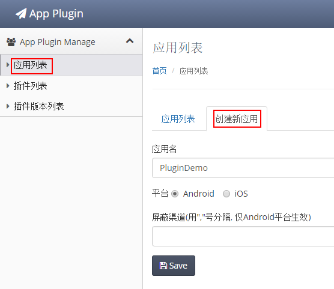
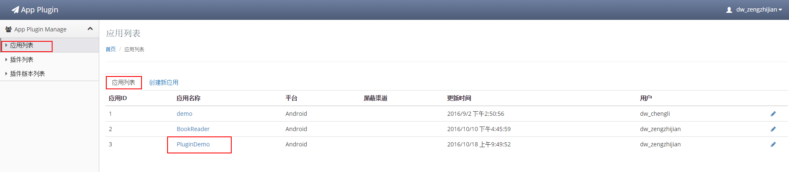
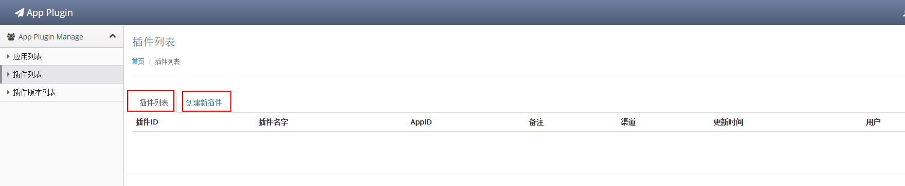
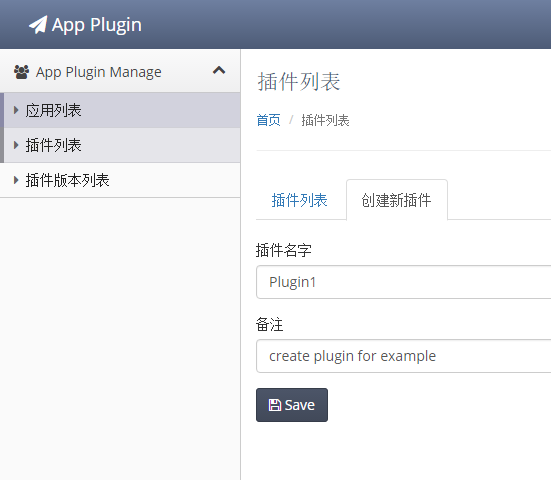
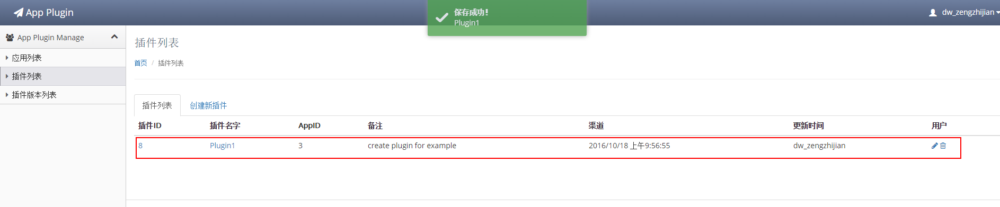
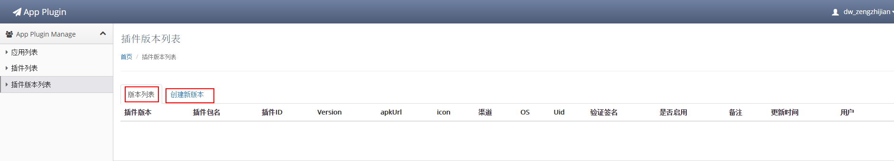
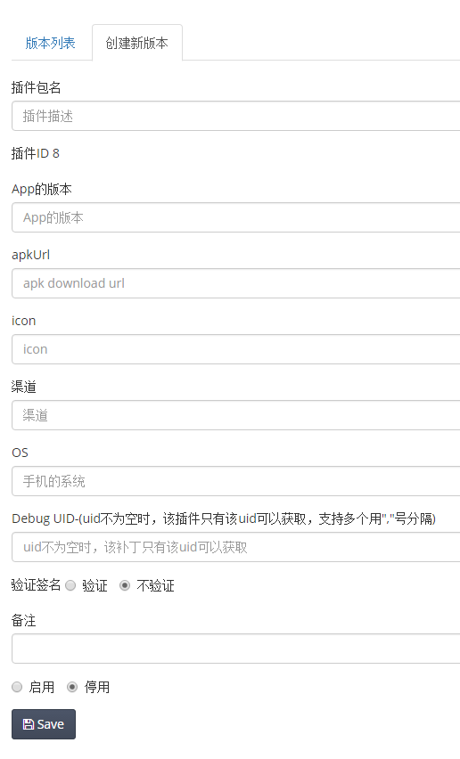
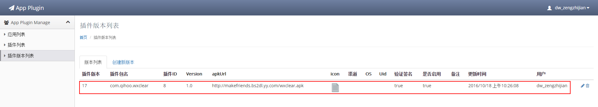

> 介绍插件项目DroidPlugin版本的使用和相关代码分析

<!-- toc orderedList:0 -->

- [Abstract](#abstract)
- [Usage](#usage)
	- [插件系统初始化操作](#插件系统初始化操作)
	- [插件服务器配置](#插件服务器配置)
	- [本地插件](#本地插件)
	- [预装载插件](#预装载插件)
	- [插件安装](#插件安装)
	- [运行插件](#运行插件)
	- [插件的运行状态](#插件的运行状态)
	- [卸载与删除插件](#卸载与删除插件)
- [源代码分析](#源代码分析)
	- [源代码框架](#源代码框架)
	- [关键流程](#关键流程)
		- [从服务器拉取插件配置和更新本地插件数据流程](#从服务器拉取插件配置和更新本地插件数据流程)
		- [已安装插件信息恢复流程](#已安装插件信息恢复流程)
		- [插件预装载流程](#插件预装载流程)
		- [插件安装流程](#插件安装流程)
		- [Hook机制](#hook机制)
		- [插件实体对应关系](#插件实体对应关系)
		- [插件运行原理简介](#插件运行原理简介)
		- [插件状态](#插件状态)
		- [插件保存方式](#插件保存方式)

<!-- tocstop -->

# Abstract

1. 用一个示例项目介绍SDK的使用
2. 介绍SDK代码结果和关键代码分析

# Usage

- 插件系统初始化操作
- 插件服务器配置
- 本地插件
- 预装载插件
- 安装插件
- 运行插件
- 插件运行的状态
- 卸载与删除插件

## 插件系统初始化操作

需要使用到插件管理系统的功能，首先需要去添加管理系统的依赖，然后是执行管理系统的初始化操作。

[项目在公司仓库的地址](http://repo.yypm.com:8181/nexus/index.html#nexus-search;quick~pluginmgr)

添加管理系统的依赖，对于`Maven`构建的项目来说可以直接使用公司仓库中提供的`Maven`依赖配置对构建出来的`aar`进行依赖。但是因为在管理系统中预先注册了用于插件运行使用的各种组件信息和权限，所以需要在主模块的`POM文件`中增加如下的配置来将管理系统中创建的`AndroidManifest`文件进行合并操作。

```xml
<build>
	<pluginManager>
			<plugins>
				<plugin>
					<groupId>com.jayway.maven.plugins.android.generation2</groupId>
					<artifactId>android-maven-plugin</artifactId>
					<configuration>
						<!-- add the following mergeManifests option -->
						<mergeManifests>true</mergeManifests>
					</configuration>
				</plugin>
			</plugins>
	<PluginManager>
</build>
```

对于使用`Gradle`构建的项目，则需要在公司仓库中手动下载构建出来的`aar`然后进行本地以来，因为`Gradle`构建的脚本默认只是了`mergeManifests`操作，所以这里不需要增加额外的配置。

在依赖添加完成之后，需要再宿主程序合适的位置调用api进行插件管理系统的初始化操作。这部分的初始化分成`DroidPlugin初始化`和`管理系统初始化`两个部分。

`DroidPlugin初始化`依然沿用原有的代码，可选择在宿主程序中使用管理系统中提供的`PluginApplication`，也可以在合适的位置调用下面的两个接口

```java
// 在宿主程序application.onCreate中调用
PluginHelper.getInstance().applicationOnCreate(Context context)

// 在宿主程序application.attachBaseContext中调用
PluginHelper.getInstance().applicationAttachBaseContext(Context context)
```

`管理系统初始化`需要调用下面的结果来完成

```java
/**
 * @param appId 宿主程序ID
 * @param appver 宿主程序版本
 * @param market 宿主程序的市场渠道
 * @param uid 当前用户的uid
 */
DroidPlugin.init(Context context, int appId, String appVer, String market, String uid)
```

在调用上面的接口进行初始化操作的同时，也会向服务器发送请求获取对应的插件配置来更新当前系统的插件内容。除了在初始化的时候直接向服务器请求插件信息之前，还预留了下面的接口专门来执行插件信息的查询工作。

```java
DrodiPlugin.instance().queryPlugin(int appId, String appVer, String market, String uid)
```

## 插件服务器配置

对于某个特定的应用程序，插件管理系统可以在后台配置对应的插件列表以及插件的详细信息。通过这个配置操作，可以实现该应用上插件的新增，更新，删除，停用等操作。

[插件管理后台地址](http://app-plugin.yy.com/admin/app_list.html)
[插件APK上传地址](http://fs.jy.yy.com/uploadfile)




创建应用时填入应用名称，选择好对应的操作系统类型之后就可以完成创建，另外，这里还提供了屏蔽的渠道接口。创建应用完成之后可以在应用列表查看到当前系统中已经创建的应用详细情况。



在应用列表中点击应用名称进入到该应用的插件列表页面展示该应用已经配置的插件，同时也可以进行创建插件的操作.



在创建插件的tab填入插件对应的信息之后，save完成插件的创建操作。



插件创建完成之后就可以在应用的插件创建列表中查看到。



在插件列表中点击对应的插件名称可以进入到该插件对应的版本列表中查看该插件已经创建了那些版本的内容，同时也可以使用创建新版本的Tab来为该插件创建新的版本。



在创建插件的新版本的时候需要填入对应的详细参数，在此之前，插件的ID在插件创建完成的时候已经分配好的。填入的参数如下：

1. 插件包名
2. 现在创建的该版本的插件将会使用在那个版本的app上
3. apkUrl要填入的是插件apk下载链接，这个链接在使用工具上传apk之后可以获得
4. icon配置的是插件图标下载的链接，同样可以使用工具上传之后获得
5. 渠道配置当前插件配置应用于哪些渠道对应的应用
6. OS对应于手机的操作系统ROM
7. Debug UID 配置多个uid，只有这些uid才可以获取到该插件
8. 是否启动插件的签名验证
9. 备注填入的信息可以用于插件的预览时的特定信息展示
10. 是否启用插件可以配置该插件是否启用

最后保存上面配置的信息，该版本的插件就创建完成



当在插件版本列表中看到刚刚配置的插件时就说明该插件的创建操作已经完成了。

## 本地插件

插件管理系统除了可以在后台配置应用对应的插件配置信息从而来使用对应的插件之外，同样会支持使用本地的插件。使用本地插件的目的在于可以针对于一个比较大型的应用开发时拆分成多个小型的插件开发，最后再整合到主程序的框架中。本地插件的时候并不需要像之前那样繁琐的配置过程，在第一次使用该插件的时候只需要将其对应的文件保存路径作为参数传入对应的API中。在后续使用的时候，该插件就会已经存在于当前的管理系统内。

```java
DroidPluginManager.instance().preLoadPluginFromPath(PLUGINS_PATH);
```

上面的这个接口调用时，将会对指定路径`PLUGINS_PATH`下的所有插件进行预加载操作。在预加载操作完成之后，返回所有插件的`PlugInfo`列表。

## 预装载插件

在插件使用的时候可能会遇到这样的一种情况，当前系统拥有多个插件需要展示出来供用户进行选择。而为了获取到这些插件用于展示的信息就需要对插件进行预装载的操作。然而，然而在进行预装载操作的时候，服务器配置的插件和本地插件会有一定的不同。因为在后台创建插件的时候已经填入了插件用于展示的一些信息(`icon/desc`)，所以在这个步骤其实可以直接拿来使用的。但是在目前的处理中，这些除了`desc`之外的参数是没有用到，其他用于展示的参数都来自于插件APK的解析。预装载操作完成之后，可以获得插件对应的`icon/label`用于展示。

```java
1. DroidPluginManager.instance().preloadPlugin(String packageName)
2. DroidPluginManager.instance().preLoadPluginFromPath(String path)
```

对于插件的预装载操作系统提供了两个不同的接口，第一个接口用于预装载所有已经存在于系统的中插件，这些插件包括了服务器配置的插件和本地插件，执行返回的结果是该包名对应插件预装载之后创建出来的`PlugInfo`对象；第二个接口专门服务于本地配置的插件，参数传入的是一个本地插件存放路径，执行的结果是该路径下所有插件预装载之后生成的`PlugInfo`列表。

## 插件安装

当前的插件管理系统是基于360的`DroidPlugin`开发出来的，插件的安装逻辑基本上也是沿用了原本的代码逻辑。因为系统使用的所有插件最初的形态都是一个apk文件，插件安装的目的是对该插件文件进行解析获取其中用于在插件运行环境需要用到的信息。和预装载插件提供的接口相同，系统中同样针对于已存在的插件和本地插件提供了两个不同的安装接口。

```java
1. DroidPluginManager.instance().installPlugin(String packageName)
2. DroidPluginManager.instance().installPluginFromPath(String path);
```

插件安装完成之后，该插件运行时需要用的信息已经被解析到当前系统中，此时插件已经处于一个可以运行的状态。

## 运行插件

在插件安装完成之后，可以在需要的使用调用下面的接口运行指定的插件完成对应的功能

```java
DroidPluginManager.instance().startPlugin(String packageName)
```

传入的参数是对应插件的包名，这个接口内容执行的也是一个常规启动流程

```java
PackageManager pm = context.getPackageManager();
Intent intent = pm.getLaunchIntentForPackage(packageName);
intent.setFlags(Intent.FLAG_ACTIVITY_NEW_TASK)
context.startActivity(intent);
```

## 插件的运行状态

插件在使用的过程中会存在不同的状态，这些状态都统一封装在了插件对应的`PlugInfo`对象中。

```java
enum STATUS{
	NONE, // 插件创建初始状态
	PRELOAD, // 插件预装载之后的状态
	INSTALLED, // 插件安装之后的状态
	RUNNING // 插件正在运行中
}
```

## 卸载与删除插件

插件使用一段时间之后，可能就会被弃用，系统提供了两种不同类型对插件弃用的操作。第一种类型是卸载插件，卸载操作会将插件的安装信息进行删除而保留下来一下基本信息，这个功能针对于当前用户不希望再使用该插件的功能但仍然希望将该插件保留再自己的插件列表中当再次需要使用的时候再进行安装，省去查找和下载插件的麻烦；第二种类型是将该插件完全的从当前系统中清除干净。在删除操作执行完成之后，该插件在系统中存在的所有信息都会被清除干净。

```java
// 卸载插件
DroidPluginManager.instance().uninstallPlugin(String packageName)

// 删除插件
DroidPluginManager.instance().deletePlugin(String packageName)
```

```{viz}
digraph deleteAnduninstall {
  // 定义节点
  node[shape = box, style = dashed, color = blue];
  unisntall[label = unisntall];
  delete[label = delete];
  node[shape = folder, color = red];
  SharePreference[label = SharePreference];
  PluginDir[label = PluginDir];
  node[shape = cds, color = green];
  Plugin[label = Plugin];
  PlugInfo[label = PlugInfo];
  PluginPackageParser[label = PluginPackageParser];

  // 关系
  unisntall -> {PluginDir PluginPackageParser}[color = slategrey, style = dashed];
  delete -> {SharePreference PluginDir Plugin PlugInfo PluginPackageParser}[color = purple, style = dashed];
}
```

# 源代码分析

## 源代码框架

```{puml}
package "Plugin Sever Controll" #dddddd{
  class PluginDownloadManager
  class PluginConfigManager
  class Plugin
}

package "Open API"{
  class DroidPluginManager
  class PlugInfo
}

package "DroidPlugin logic"{
  class PluginManager
  class IPluginManagerImpl
  class PluginPackageParser  
}
```
上面的类图大体表述了插件系统的代码组织结构。

`Plugin Server Controll`部分的代码负责和服务器进行交互从服务器上拉取当前应用对应的插件配置，根据这些配置对系统当前使用的配置进行校验（插件更新以及删除无用的插件，不包含本地插件）。而对于本地插件，这里只负责对本地插件信息进行保存和创建对应的`Plugin`对象。

`DroidPlugin Logic`是原本`DroidPlugin`开源库的逻辑内容。其中包含插件安装的实际操作，插件运行的原理内容。

`Open API`部分对整个SDK的功能进行抽象并开放对应的逻辑接口给使用SDK的应用程序。

## 关键流程

### 从服务器拉取插件配置和更新本地插件数据流程

```{puml}
title 从服务器拉取插件配置进行插件更新流程

start

: 向服务器请求当前应用插件配置，参数：appID, appVer, market, uid;

if( 请求成功？ ) then (success)
  : 解析 json 获取最新远端插件列表;
  : 获取原有的插件列表;
  : 将新插件列表保存到本地
  并创建每个插件对应的PlugInfo;
  : 获取本地插件列表并对每个
  插件创建对应的PlugInfo;
  while( 对旧列表项进行遍历 )
    if( 旧列表项可以删除？ ) then (yeas)
      : 删除旧列表项;
    elseif( 旧列表项需要更新？ ) then (yeas)
      : 更新旧列表项;
    else
      : 下载对应插件;
    endif
  endwhile
  end
else (fail)
  end
```

```{puml}
title 从服务器拉取插件配置进行插件更新流程

participant PluginDownloadManager
participant PluginConfigManager
participant DroidPluginManager
participant Utils

[-> PluginConfigManager: readFromFile()

[-> PluginDownloadManager: queryPlugin(appID, appVer, market, uid)
activate PluginDownloadManager

PluginDownloadManager -> PluginConfigManager: getRemotePluginList()
activate PluginConfigManager
PluginConfigManager --> PluginDownloadManager: oldPluginList
deactivate PluginConfigManager

PluginDownloadManager -> PluginConfigManager: updatePluginFromServer
activate PluginConfigManager
PluginConfigManager -> DroidPluginManager: create PlugInfo (Remote & Local)
PluginConfigManager -> PluginConfigManager: writeToFile
deactivate PluginConfigManager

group oldPluginList.foreach
alt isPluginNeedDelete
PluginDownloadManager -> DroidPluginManager: deletePlugin()
else isPluginNeedUpdate
PluginDownloadManager -> Utils: emptyDir()
end
end

PluginDownloadManager -> PluginConfigManager: getRemotePluginList()
PluginConfigManager --> PluginDownloadManager: newPluginList
group newPluginList.foreach
PluginDownloadManager -> PluginDownloadManager: downloadPlugin()
end
```

上图表述的是向服务器请求该应用当前插件配置列表，并和当前本地保存的插件列表进行交叉对比，更新插件的流程。

在向服务器发送请求获取当前应用的插件配置列表的时候，需要携带下面的几个参数：
`appID`: 应用程序ID
`appVersion`: 对应的应用程序的版本
`market`：针对特定的市场渠道
`uid`：针对特定的uid

在成功查询到最新的配置列表之后，会将该配置列表保存到本地配置文件中然后对当前系统中的每个插件（Remote & Local）创建对应的`PlugInfo`对象。在完成这些工作之后，继续对最开始获取到的旧插件列表（Remote）进行校验，校验的内容包括该插件是否已经启用，该插件是否需要进行升级。完成旧版本插件列表校验之后将会执行最后的下载操作，针对新插件列表（Remote）中需要下载的进行下载操作。

在整个流程中，旧版本插件列表(Remote)的校验完成后主要执行的对于插件存储系统中保存的插件文件信息，因为`Plugin/PlugInfo`在最开始的时候就已经被更新掉。此外，整个下载更新的流程对于`Disenable`的插件不会做任何的限制，这个标识只会在插件安装，尝试使用插件的时候产生影响。

### 已安装插件信息恢复流程

```{puml}
title  已安装插件信息恢复流程

start
if( 启动插件的方式 ) then ( preLoad )
	: 加载指定的APK文件;

	partition 创建apk对应的Plugin {
		if ( apk文件存在 ) then (yeas)
			: 创建apk文件对应的packageinfo;
			if ( PackageInfo成功获取 ) then ( yeas )
				: 获取该文件的包名;
				: 根据包名尝试从本地缓存中获取Plugin;
				if ( Plugin 成功获取到) then ( yeas )
					: 返回获取到的缓存对象;
				else ( no )
					: 根据当前信息创建Plugin;
					: 将创建出来的对象保存到缓存中;
					: 返回新创建的对象;
				endif
			else ( no )
				: return null;
			endif
		else ( no )
			: return null;
		endif
	}

	partition 创建对应的PlugInfo {
		if ( Plugin == null ) then ( true )
			: 预加载发生错误;
			: return null;
		else ( false )
			: 尝试从缓存中获取对应的PlugInfo;
			if ( PlugInfo == null ) then ( yeas )
				: 为Plugin创建对应的PlguInfo;
				: 执行预加载操作;
				: 将创建的PlugInfo保存到缓存中;
				: 返回新建的PlugInfo;
			else ( no )
				: 返回获取到的缓存;
			endif
		endif
	}
else ( install )
	: 加载指定的apk文件;
	: 使用和Preload相同的方式尝试获取PlugInfo;
	if ( PlugInfo == null ) then ( yeas )
		: 安装本地插件发生错误;
		: return null;
	else ( no )
		: 执行install操作;
		: 保存到缓存中;
		: 返回获取到的PlugInfo;
	endif
endif
```

上图表述的是本地类型插件从无到有进入整个系统的过程。入口的途径有两条，按照具体的需求可以选择使用预加载或者是直接安装的两种方式，在这两条路径上，尝试创建`Plugin`的过程是共同的，而也就是在这个过程中将本地插件的相关信息保存到了本地的配置文件，同时也将对应的`APK文件`拷贝到了插件系统对应的存储路径下。所以在完成了上述操作之后，系统每次启动的时候都可以从配置文件中获取到本地插件的相关信息，而至此本地插件也就真正的进入到了当前应用的插件系统中。

之前在介绍从服务器获取插件配置列表并且更新本地插件的时候有提及到，在利用服务器获取到的新数据进行本地配置更新的时候会为每个插件创建对用的`PlugInfo`对象，这里的操作同样也包括了本地插件。这样做的目的是为了在插件系统启动的时候就完成了`Plugin`和`PlugInfo`的对应关系，方便后续的逻辑操作。

在本地插件真正进入到当前应用的插件系统之后，每次插件系统启动的时候除了从配置文件中获取本地插件的相关信息外，同时也会在插件的存储系统中进行扫描恢复所有已经安装完成的插件信息保存在一个`PluginPackageParser`列表中。虽然这个过程同样涉及到远端的插件，但是也在这里一并讲了。

```{puml}
title 已安装插件信息恢复

participant PluginManagerService
participant IPluginManagerImpl

[-> PluginManagerService: onCreate
PluginManagerService -> IPluginManagerImpl: onCreate()
activate IPluginManagerImpl
IPluginManagerImpl -> IPluginManagerImpl: onCreateInner()
activate IPluginManagerImpl
IPluginManagerImpl -> IPluginManagerImpl: laodAll()
activate IPluginManagerImpl
deactivate IPluginManagerImpl
deactivate IPluginManagerImpl
deactivate IPluginManagerImpl
```

```{puml}
title loadAllPlugin流程

start
: PluginDirHelper.getBaseDir;
while (对BaseDir进行遍历)
	if (dir.isDirectory && dir.length > 1)
		: 从插件目录中获取apk文件;
		: 保存到文件列表中;
	else (false)
		: continue;
	endif
endwhile
while(文件列表进行遍历)
	: 使用该文件创建对应PluginPackageParser;
	: 获取签名文件;
	: 保存PluginPackageParser到缓存中;
endwhile
stop
```

上图显示的从插件存储系统中恢复已安装插件信息的流程。在流程图中可以看到，这个恢复流程是从`PluginManagerService`启动的时候开始的，然后一只辗转到调用`IPluginManagerImpl.loadAllPlugin()`来执行恢复的具体操作。首先会从插件存储系统的保存目录中进行遍历，从其中找到所有的可能是安装完成的插件。在这里的判断条件有两个，第一是apk目录下必须存在对应的apk文件，第二个点是该插件的目录下除了apk目录之外应该还有其他的文件目录存在。额外增加第二点判断是因为在插件卸载之后仍然会把apk文件保留在原来的目录下面，如果这个时候不增加第二点判断条件，那么就会错误地将已经卸载的插件当作安装完成的插件进行加载。

这里还存在一个没有弄清楚地方就是关于签名文件，包括整个签名文件地获取，保存，使用地意义等等。

### 插件预装载流程

```{puml}
title 插件预装载流程

start
if (预装载插件类型) then (Local)
	: 使用对应APK文件创建对应的Plugin;
	if (Plugin == null) then (yeas)
		: 本地预加载错误;
		: return null;
	else (no)
		: 根据获取的Plugin从缓存中获取PlugInfo;
		if (PlugInfo == null) then (yeas)
			: 创建新的PlugInfo;
			: 保存到本地缓存中;
			: 执行PlugInfo的预加载操作;
		else (no)
			: 使用缓存中获取的PlugInfo执行预加载操作;
		endif
	endif
else (Remote)
	: 尝试从缓存中获取PlugInfo;
	if (PlugInfo == null)	then (yeas)
		: 从缓存中获取对应地Plugin;
		if (Plugin == null) then (yeas)
			: 预加载错误;
		else (no)
			: 使用Plugin创建对应地PlugInfo;
			: 保存PlugInfo到缓存中;
			: 执行PlugInfo的预加载操作;
		endif
	else (no)
		: 执行PlugInfo的预加载操作;
	endif
endif
```

关于插件预装载，首要说明的是执行这个过程的意义。在当前系统中存在多个插件，或者是应用希望同时展现出一个可选择使用的插件列表的时候，就需要从插件中获取到用于展示的基本信息。按照和服务器定义的`Plugin`实体的配置信息本来是可以完成这个工作，但是最开始没有注意到这一部分的内容，而且也要兼容到本地插件的预装载信息。所以在这里采用的方案是直接对插件的APK文件进行解析，目的是为了获取到插件的`应用名称\应用图标`用于插件列表的展示。这部分的实在操作封装在`PlugInfo`中，关键代码如下:

```java
PackageManager pm = context.getPackageManager();
PackageInfo pi = pm.getPackageArchiveInfo(apkFile.getAbsolutePath(), 0);
if (pi == null){
    Log.e(TAG, "doPreLoad can not get PackageInfo for apk: " + apkFile.getAbsolutePath());
    return false;
}
pi.applicationInfo.sourceDir = apkFile.getAbsolutePath();
pi.applicationInfo.publicSourceDir = apkFile.getAbsolutePath();
label = (String) pi.applicationInfo.loadLabel(pm);
icon = pi.applicationInfo.loadIcon(pm);
pluginStatus = STATUS.PRELOADED;
```

代码的核心部分是尝试获取当前APK文件的`PackageInfo`，如果这个获取操作失败就直接判定当前的APK文件是不可用的，成功获取之后就可以直接从其中获取需要的内容。

### 插件安装流程

插件的安装虽然会有本地插件安装和远端服务器配置插件安装两种流程，但其实两种方式不同点仅仅在于本地插件安装的时候，最开始本地插件是不存在与之对应的`Plugin`信息的，在这个方面的缺陷就需要手动的从该插件构建出对应的`Plugin`并切保存到本地配置文件中。在Plugin创建完成之后，两种不同类型的插件安装过程实际上就合并到了同样的一条操作路径中。所以在介绍关于插件安装的过程时分成两个部分的内容，第一个是为本地插件创建对应`Plugin`的过程；第二个则是`PlugInfo`作为起点的插件安装路径。

```{puml}
title 本地插件创建Plugin流程

participant PluginConfigManager
participant Context
participant PackageManager
participant Plugin

[-> PluginConfigManager: getPlugin(originPath, context, replaceFlag)
activate PluginConfigManager
PluginConfigManager -> Context: getPackageManager()
Context --> PluginConfigManager: pm
PluginConfigManager -> PackageManager: getPackageArchiveInfo(originPath, 0)
PackageManager --> PluginConfigManager: pi
note left: can get some information about apk
PluginConfigManager -> PluginConfigManager: try to get plugin from cache
alt plugin not in cache
PluginConfigManager -> Plugin: new Plugin()
Plugin --> PluginConfigManager: plugin
PluginConfigManager -> PluginConfigManager: save to cache
PluginConfigManager -> PluginConfigManager: writeToFile
note left: save the new plugin to SharePreference
else plugin in cache
PluginConfigManager -> PluginConfigManager: return cache plugin
end
```

在这个流程中，最基本的条件是可以从`originPath`指定目录下获取到该文件`PackageInfo`。在成功获取到`PackageInfo`之后可以使用对应的包名尝试在缓存中获取到对应`Plugin`对象，当该对象不存在的时候就会尝试使用现有的信息来构建`Plugin`对象。这些现有的填充出来的本地`Plugin`对象应该是下面的这种数据结构:

```javascript
Plugin {
	pluginID: LOCAL_ID;
	url: originPath;
	enable: true;
	packageName: packageName
}
```

因为该插件信息是从本地生成的，所以配置的是一个统一的LOCAL_ID；然后会在url中保存APK文件原始放置路径；最后packageName则是直接从PackageInfo中解析出来；当然，对于所有的本地插件来说，enable字段都是true值。

只要配置完对应的`Plugin`对象之后，这个流程基本上算是完成了，后面只需要把新生成的对象保存到合适的位置。但是上面的流程图中对于`replaceFlag`参数的时候并没有表述出来，在这里需要做一个补充说明。因为考虑到本地插件不能够向远端服务器下载的插件那样可以通过插件的ID和版本号来进行更新操作，所以在开这个接口的时候留下了一个`replaceFlag`参数来配置在缓存中已经存在对应包名插件的时候采取怎样的操作，可以是直接返回不替代也可以删除旧的插件采用替代的方式导入新的插件。

在完成本地插件信息获取过程分析之后，现在来介绍插件的具体安装过程。

```{puml}
title 插件安装流程

participant IPluginManagerImpl
participant Context
participant PackageManager
participant PluginPackageParser
participant BaseActivityManagerService

[-> IPluginManagerImpl: installPlugin(pluginFile)
activate IPluginManagerImpl
IPluginManagerImpl -> Context: getPackageManager()
Context --> IPluginManagerImpl: pm
IPluginManagerImpl -> PackageManager: getPackageArchiveInfo(pluginFile, 0)
PackageManager --> IPluginManagerImpl: pi
IPluginManagerImpl -> IPluginManagerImpl: forceStopPackage(packageName)
IPluginManagerImpl -> PluginPackageParser: new PluginPackageParser()
PluginPackageParser --> IPluginManagerImpl: parser
IPluginManagerImpl -> PluginPackageParser: collectCertification()
IPluginManagerImpl -> PluginPackageParser: 检查权限是否允许运行
IPluginManagerImpl -> PluginPackageParser: 获取签名文件
IPluginManagerImpl -> IPluginManagerImpl: copyNativeLibs(parser)
IPluginManagerImpl -> IPluginManagerImpl: dexOpt(context, parser)
IPluginManagerImpl -> IPluginManagerImpl: save parser to cache
IPluginManagerImpl -> BaseActivityManagerService: onPkgInstalled(parserCache, parser, pkg)
IPluginManagerImpl -> IPluginManagerImpl: sendInstalledBroadcast(packageName)
deactivate IPluginManagerImpl
```

整个插件的安装流程基本上采用的还是`DroidPlugin`原来的那一套，在最开始的部分仍然需要获取到APK文件的包名，然后通过这个包名尝试关闭当前在运行的同包名的插件。关闭同名插件的关键代码如下：

```java
public boolean killBackgroundProcesses(String pluginPackageName) throws RemoteException {
	ActivityManager am = (ActivityManager) mContext.getSystemService(Context.ACTIVITY_SERVICE);
	List<RunningAppProcessInfo> infos = am.getRunningAppProcesses();
	boolean success = false;
	for (RunningAppProcessInfo info : infos) {
			if (info.pkgList != null) {
					String[] pkgListCopy = Arrays.copyOf(info.pkgList, info.pkgList.length);
					Arrays.sort(pkgListCopy);
					if (Arrays.binarySearch(pkgListCopy, pluginPackageName) >= 0 && info.pid != android.os.Process.myPid()) {
							Log.i(TAG, "killBackgroundProcesses(%s),pkgList=%s,pid=%s", pluginPackageName, Arrays.toString(info.pkgList), info.pid);
							android.os.Process.killProcess(info.pid);
							success = true;
					}
			}
	}
	return success;
}
```

上面的代码遍历了正在运行的进程并通过匹配插件的包名来确定需要关掉的进程来达到停止正在运行的同名插件的目的。

在准备上面的准备工作完成之后，会去创建在插件安装工程中的一个关键类`PluginPackageParser`，整个插件的的安装工作基本上在这个类的构造函数中就执行的差不多了，而且后续插件使用的过程中也无法避免的要和这个类进行交互。

```{puml}
class PackageInfo{

}

class PluginPackageParser{
	- final File mPluginFile
	- final PackageParser mParser
	- final String mPackageName
	- final Context mHostContext
	- final PackageInfo mHostPackageInfo
	..
	1. 在这个类的构造函数过程中，会从创建的
	PackageParser中获取到关于apk的各种组件
	的信息
}

class PackageParser{

}

PluginPackageParser -> PackageParser
PackageInfo <- PluginPackageParser
```

```{puml}
title PluginPackageParser 创建流程

participant PluginPackageParser
participant PackageParser
participant ComponentName

[-> PluginPackageParser: new PluginPackageParser(context, pluginFile)
activate PluginPackageParser
PluginPackageParser -> PackageParser: newPluginParser(context)
activate PackageParser
PackageParser --> PluginPackageParser: mParser
deactivate PackageParser

== 获取Activity相关信息 ==
PluginPackageParser -> PackageParser: getActivities()
activate PackageParser
activate PluginPackageParser
PackageParser --> PluginPackageParser: datas
deactivate PackageParser

group datas.loop
PluginPackageParser -> ComponentName: new ComponentName(packageName, mParser.readNameFromComponent(data))
activate ComponentName
ComponentName --> PluginPackageParser: componentName
deactivate ComponentName

PluginPackageParser -> PluginPackageParser: mActivityObjCache.put(componentName, data)
PluginPackageParser -> PackageParser: generateActivityInfo(data, 0)
activate PackageParser
PackageParser --> PluginPackageParser: value
deactivate PackageParser
PluginPackageParser -> PluginPackageParser: fixApplicationInfo(value.application)
PluginPackageParser -> PluginPackageParser: mActivityInfoCache.put(componentName, value)

PluginPackageParser -> PackageParser: readIntentFilterFromComponent(data)
activate PackageParser
PackageParser --> PluginPackageParser: filters
deactivate PackageParser
PluginPackageParser -> PluginPackageParser: mActivityIntentFilterCache.remove(componentName)
PluginPackageParser -> PluginPackageParser: mactivityintentFilterCache.put(componentName, filters)

end

PluginPackageParser -> PluginPackageParser: decode info from datas
deactivate PluginPackageParser

== 获取Service相关信息 ==
|||
== 获取Provider相关信息 ==
|||
== 获取Receivers相关信息 ==
|||
== 获取Insturmentation相关信息 ==
|||
== 获取Permission相关信息 ==

```

`PluginPackageParser`类主要依赖`PackageParser`类来获取插件的各种相关信息。这些信息的获取操作如上图所示，在`PluginPackageParser`的构造函数中创建完`PackageParser`对象之后就开始执行插件信息获取的操作，其实整个插件的安装工作大部分都是从插件插件中解析出这些信息内容，所以在整个构造函数执行完毕的时候，插件的安装过程已经完成了一大半。因为获取各种信息的操作基本差不多所以在流程图中就采用了比较简略的写法来表述，具体的信息的可以查看相关的代码。在这个流程中还有一个`fixApplicationInfo`函数需要详细看一下:

```java
private ApplicationInfo fixApplicationInfo(ApplicationInfo applicationInfo) {
		if (applicationInfo.sourceDir == null) {
				applicationInfo.sourceDir = mPluginFile.getPath();
		}
		if (applicationInfo.publicSourceDir == null) {
				applicationInfo.publicSourceDir = mPluginFile.getPath();
		}

		if (applicationInfo.dataDir == null) {
				applicationInfo.dataDir = PluginDirHelper.getPluginDataDir(getPluginBaseDirName(), mPackageName);
		}

		try {
				if (Build.VERSION.SDK_INT >= Build.VERSION_CODES.LOLLIPOP) {
						if (FieldUtils.readField(applicationInfo, "scanSourceDir", true) == null) {
								FieldUtils.writeField(applicationInfo, "scanSourceDir", applicationInfo.dataDir, true);
						}
				}
		} catch (Throwable e) {
				//Do nothing
		}

		try {
				if (Build.VERSION.SDK_INT >= Build.VERSION_CODES.LOLLIPOP) {
						if (FieldUtils.readField(applicationInfo, "scanPublicSourceDir", true) == null) {
								FieldUtils.writeField(applicationInfo, "scanPublicSourceDir", applicationInfo.dataDir, true);
						}
				}
		} catch (Throwable e) {
				//Do nothing
		}

		applicationInfo.uid = mHostPackageInfo.applicationInfo.uid;

		if (Build.VERSION.SDK_INT >= Build.VERSION_CODES.GINGERBREAD) {
				if (applicationInfo.nativeLibraryDir == null) {
						applicationInfo.nativeLibraryDir = PluginDirHelper.getPluginNativeLibraryDir(getPluginBaseDirName());
				}
		}

		if (Build.VERSION.SDK_INT >= Build.VERSION_CODES.LOLLIPOP) {
				if (applicationInfo.splitSourceDirs == null) {
						applicationInfo.splitSourceDirs = new String[]{mPluginFile.getPath()};
				}
		}

		if (Build.VERSION.SDK_INT >= Build.VERSION_CODES.LOLLIPOP) {
				if (applicationInfo.splitPublicSourceDirs == null) {
						applicationInfo.splitPublicSourceDirs = new String[]{mPluginFile.getPath()};
				}
		}

		if (TextUtils.isEmpty(applicationInfo.processName)) {
				applicationInfo.processName = applicationInfo.packageName;
		}
		return applicationInfo;
}
```

在构造函数获取插件信息的过程中，会调用该函数对所有组件相对应的`Application`进行设置，在这个设置的过程中，会将`Application`中各种路径参数对应到我们自己插件系统中具体路径。

### Hook机制


### 插件实体对应关系

### 插件运行原理简介

### 插件状态

### 插件保存方式
